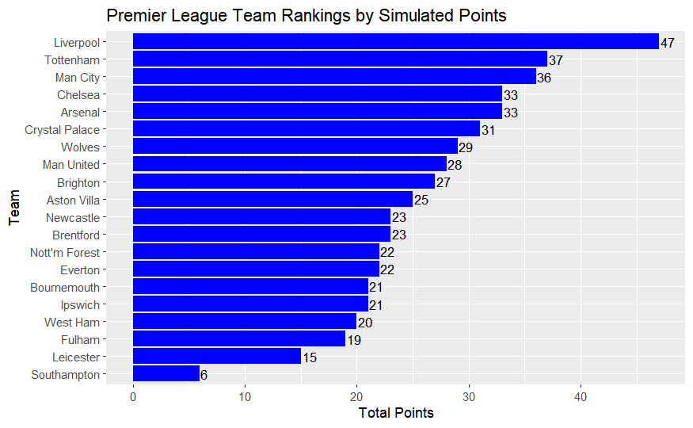
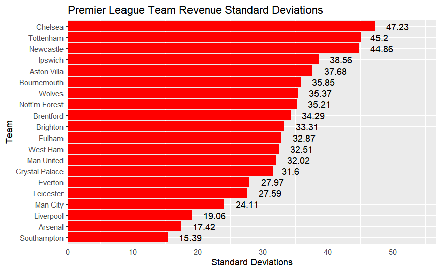
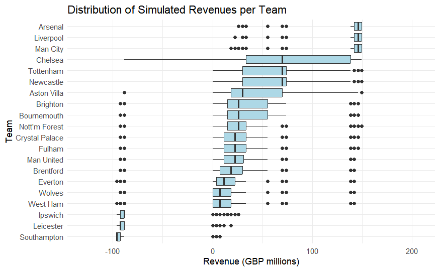
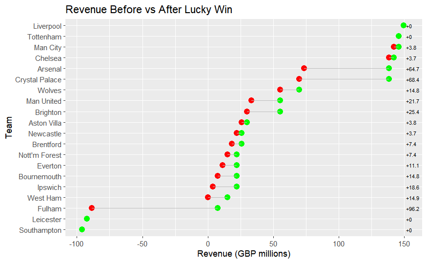
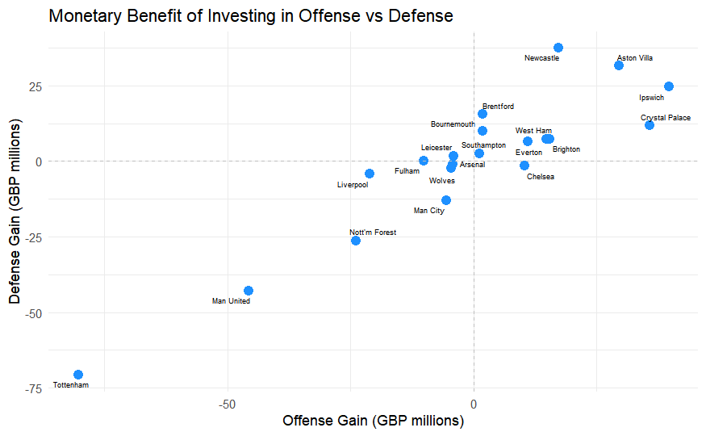

# Soccer-Simulation

This project simulates a full-season soccer league to evaluate how changes in team performance—such as improved offense or defense—affect league standings and financial outcomes. It uses Poisson models to estimate match scores and translates results into projected revenue.

## Objective

- Simulate soccer match outcomes across a full league season using team-level performance parameters.
- Assess the impact of a 10% increase in goals scored or decrease in goals conceded on team rankings and revenue.
- Quantify revenue variability and the effect of unlikely wins on financial outcomes.

## Methods

- Each match is simulated using Poisson-distributed goal counts, reflecting each team’s attacking and defensive strength.
- R functions to handle fixture generation, match simulation, season aggregation, and ranking.
- Revenue is mapped to league position using predefined assumptions, allowing scenario-based analysis.
- Multiple simulations are run to measure volatility, revenue shifts, and gain from strategic changes.

## Key Insights

- Defensive improvements often provide more consistent value than comparable offensive gains.
- Some teams benefit substantially from marginal performance changes, while others show minimal sensitivity.
- Revenue volatility varies widely across teams, informing strategic planning under uncertainty.

## Tools

- **Language**: R
- **Libraries**: `dplyr`, `ggplot2`, `purrr`
- **File**: `soccer_simulation.Rmd` contains all code, logic, and plots

## Visualizations

The following graphs illustrate key insights from the simulation. All plots are stored in the `Graphs/` folder.
### Ranking by Points
Displays the simulated league table based on average total points.  

### Revenue Standard Deviation
Ranks teams by the volatility of their simulated revenues.  

### Distribution of Simulated Revenue
Shows the range of potential revenue outcomes per team across simulated seasons.  

### Revenue Before and After Lucky Win
Highlights the change in projected revenue from a single unexpected win.  

### Offense vs Defense Investment
Compares the monetary gain (in GBP millions) from improving offense vs defense for each team. 

## Key Takeaways

- **Marginal improvements don't always change outcomes**  
  For many teams, a 10% boost in performance increases the goal margin in matches they were already winning, but does not convert key losses or draws into wins. These teams see limited change in total points or final standing.

- **Revenue gains are tied to rank thresholds**  
  League revenue follows a nonlinear structure. Moving from 4th to 3rd place, or from a relegation spot into mid-table, results in a disproportionate increase in revenue. Small point gains can produce outsized financial impact. Understanding where a team stands in relation to these thresholds is key for targeting performance investment efficiently.

